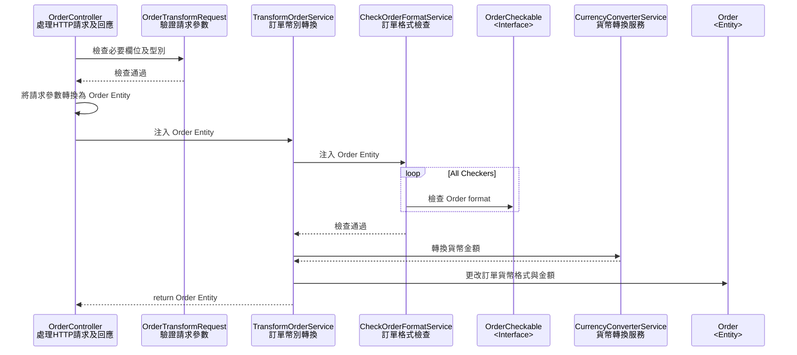

# AsiaYo - Mid Backend Engineer Assignment

## 資料庫測驗

### 題目一回答

```mysql
select
    bnbs.id as bnb_id,
    bnbs.name as bnb_name,
    sum(orders.amount) may_amount
from orders
join bnbs on bnbs.id = orders.bnb_id
where orders.currency = 'TWD'
and orders.created_at between '2023-05-01 00:00:00' and '2023-05-31 23:59:59'
group by orders.bnb_id
order by may_amount desc
limit 10;
```

### 題目二回答

#### 優化方式及步驟

1. 使用 `EXPLAIN` statement 解析查表狀況，經分析，於題目一回答的 SQL statement，`WHERE` 條件並未有效縮小查詢範圍，屬於全表查詢 (`type: ALL`, `rows: 4980`)，p.s. 全表共 5000 筆資料

    | id | select\_type | table | partitions | type | possible\_keys | key | key\_len | ref | rows | filtered | Extra |
    | :--- | :--- | :--- | :--- | :--- | :--- | :--- | :--- | :--- | :--- | :--- | :--- |
    | 1 | SIMPLE | orders | null | ALL | orders\_bnb\_id\_foreign | null | null | null | 4980 | 3.7 | Using where; Using temporary; Using filesort |
    | 1 | SIMPLE | bnbs | null | eq\_ref | PRIMARY | PRIMARY | 8 | asiayo.orders.bnb\_id | 1 | 100 | null |
2. 縮小資料查詢範圍，將欄位 (`currency`, `created_at`) 製作 composite key，有效縮小查詢範圍 (`type: range`, `rows: 600`)

    | id | select\_type | table | partitions | type | possible\_keys | key | key\_len | ref | rows | filtered | Extra |
    | :--- | :--- | :--- | :--- | :--- | :--- | :--- | :--- | :--- | :--- | :--- | :--- |
    | 1 | SIMPLE | orders | null | range | orders\_bnb\_id\_foreign,orders\_currency\_created\_at\_index | orders\_currency\_created\_at\_index | 5 | null | 600 | 100 | Using index condition; Using temporary; Using filesort |
    | 1 | SIMPLE | bnbs | null | eq\_ref | PRIMARY | PRIMARY | 8 | asiayo.orders.bnb\_id | 1 | 100 | null |
3. 如果查詢時間仍太長，或許應從其他面向檢查，將資料存放至 read-only database，排除因為 rows lock 影響查詢速度可能性
4. 將**計算**和**排序**移到應用程式裡執行，減輕 database 運算時帶來的效能負擔

## API 實作測驗

### Usage

1. 下載專案程式碼
    ```shell
    git clone https://github.com/benny-sun/AsiaYoAssignment.git
    ```
2. 進入專案目錄 `/AsiaYoAssignment`，可以執行以下指令啟動 docker containers
    ```shell
    cd ./docker && docker-compose up -d --build && docker-compose exec asiayo-php bash -c "cp .env.example .env && composer install"
    ```
3. 域名為 `localhost:8080`，以 curl 為例，使用 JSON Type 訪問 `POST /api/orders` endpoint:
    ```shell
    curl --location 'localhost:8080/api/orders' --header 'Accept: application/json' --header 'Content-Type: application/json' --data '{"id":"A0000001","name":"Melody Holiday Inn","address":{"city":"taipei-city","district":"da-an-district","street":"fuxing-south-road"},"price":"60","currency":"USD"}'
    ```

### Sequence Diagram



### SOLID Principles and Design Patterns

1. 產生 `Currency` 物件的過程，使用 [Strategy Pattern](https://refactoring.guru/design-patterns/strategy) 搭配 [Simple Factory Pattern](https://designpatternsphp.readthedocs.io/en/latest/Creational/SimpleFactory/README.html), 並且符合 SOLID Principles 中的 SRP, OCP, ISP, DIP，方便日後新增其他國家的貨幣及匯率規則
2. 檢查訂單明細格式的部分 (class `CheckOrderFormatService`)，採用 [Chain of Responsibility Pattern](https://refactoring.guru/design-patterns/chain-of-responsibility)，並且符合 SOLID Principles 中的 SRP, OCP, ISP, DIP，未來若要擴充更多檢查關卡，能夠更容易應對變化

### Testing

- Feature Tests
  - Directory: `/src/tests/Feature`
  - 針對 API endpoint 測試，包含本測驗的所有情境
  - 測試資料位於 `/src/tests/Feature/DataProviders/`
- Unit Tests:
  - Directory: `/src/tests/Unit`
  - 包含訂單格式檢查，以及貨幣格式轉換的單元測試
  - 測試資料位於每個 Unit Test 檔案中

### Code Coverage Report

```shell
PHPUnit 11.3.0 by Sebastian Bergmann and contributors.

Runtime:       PHP 8.2.22 with Xdebug 3.3.0
Configuration: /var/www/html/phpunit.xml

....................                                              20 / 20 (100%)

Time: 00:10.372, Memory: 32.00 MB

OK (20 tests, 32 assertions)


Code Coverage Report:
  2024-08-08 04:18:37

 Summary:
  Classes: 87.50% (14/16)
  Methods: 94.12% (32/34)
  Lines:   97.92% (94/96)

App\Exceptions\InvalidOrderException
  Methods: 100.00% ( 1/ 1)   Lines: 100.00% (  6/  6)
App\Http\Controllers\OrderController
  Methods: 100.00% ( 3/ 3)   Lines: 100.00% ( 15/ 15)
App\Http\Requests\OrderTransformRequest
  Methods: 100.00% ( 2/ 2)   Lines: 100.00% ( 10/ 10)
App\Providers\AppServiceProvider
  Methods: 100.00% ( 2/ 2)   Lines: 100.00% ( 11/ 11)
App\Services\CheckOrderFormatService
  Methods: 100.00% ( 2/ 2)   Lines: 100.00% (  4/  4)
App\Services\CurrencyConverterService
  Methods: 100.00% ( 1/ 1)   Lines: 100.00% (  2/  2)
App\Services\Currency\CurrencyFactory
  Methods: 100.00% ( 1/ 1)   Lines: 100.00% (  4/  4)
App\Services\Currency\NONE
  Methods:  50.00% ( 1/ 2)   Lines:  50.00% (  1/  2)
App\Services\Currency\TWD
  Methods: 100.00% ( 2/ 2)   Lines: 100.00% (  2/  2)
App\Services\Currency\USD
  Methods:  50.00% ( 1/ 2)   Lines:  50.00% (  1/  2)
App\Services\Entities\Order
  Methods: 100.00% ( 7/ 7)   Lines: 100.00% ( 13/ 13)
App\Services\OrderCheckers\CurrencyChecker
  Methods: 100.00% ( 1/ 1)   Lines: 100.00% (  2/  2)
App\Services\OrderCheckers\NameChecker
  Methods: 100.00% ( 1/ 1)   Lines: 100.00% (  4/  4)
App\Services\OrderCheckers\PriceChecker
  Methods: 100.00% ( 2/ 2)   Lines: 100.00% (  5/  5)
App\Services\TransformOrderService
  Methods: 100.00% ( 3/ 3)   Lines: 100.00% (  8/  8)
App\Services\ValueObjects\Address
  Methods: 100.00% ( 2/ 2)   Lines: 100.00% (  6/  6)
```
